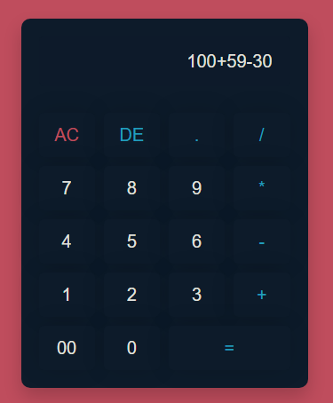

# 🧮 Calculadora Web Simple - T.P Prog. IV

¡Bienvenido/a a mi proyecto de Calculadora! Este es un trabajo práctico creado para poner a prueba y afianzar conocimientos en desarrollo web front-end, utilizando únicamente **HTML, CSS y JavaScript** puro.

El objetivo era construir una calculadora funcional y con un diseño agradable desde cero. Es un excelente ejercicio para entender la manipulación del DOM, el manejo de eventos y la maquetación con CSS moderno.

### 📸 Captura de Pantalla



---

### ✨ Características

*   **Operaciones básicas:** Suma, resta, multiplicación y división.
*   **Pantalla digital:** Muestra los números y el resultado.
*   **Botón 'AC' (All Clear):** Limpia la pantalla por completo.
*   **Botón 'DE' (Delete):** Borra el último dígito o carácter introducido.
*   **Diseño responsive:** Se adapta a diferentes tamaños de pantalla gracias a CSS Grid.

### 🛠️ Tecnologías Utilizadas

*   **HTML:** Para la estructura semántica de la calculadora.
*   **CSS:** Para el diseño, la maquetación (usando CSS Grid) y la estética general.
*   **JavaScript:** Para toda la lógica y la funcionalidad de los botones.

### 🚀 ¿Cómo usarla?

¡Es muy fácil! No necesitas instalar nada.
1.  Clona o descarga este repositorio.
2.  Abre el archivo `index.html` en tu navegador web favorito.
3.  ¡Y listo! Ya puedes empezar a calcular.

### 📂 Estructura del Proyecto
```
/Calculadora
├── index.html      # El esqueleto de la aplicación
├── style.css       # Los estilos y el diseño visual
└── script.js       # La magia y la lógica de la calculadora
```
